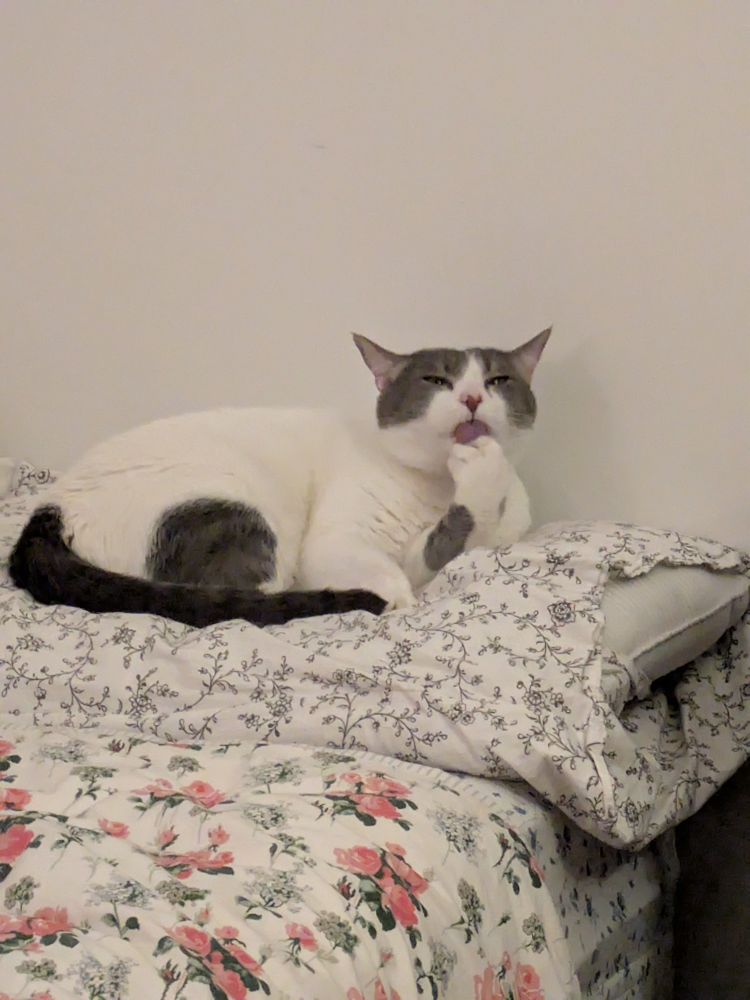

::: {.hero-text}

text 

## Non-Academic Projects

:::

::: {.d-flex .flex-column .align-items-center}
{width="300px"}

::: {.d-flex .gap-3 .mt-3}
<!-- Centered Row of Clickable Icons -->
<a href="https://github.com/gormanr33" target="_blank" class="text-dark"><i class="bi bi-github fs-2"></i></a>
<a href="https://www.linkedin.com/in/rachel-gorman-6825431b9" target="_blank" class="text-primary"><i class="bi bi-linkedin fs-2"></i></a>
<a href="mailto:gormanr33@gmail.com" class="text-danger"><i class="bi bi-envelope-fill"></i></a>
:::
:::